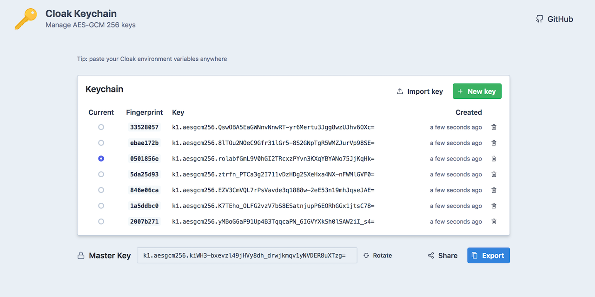

# [Cloak UI](https://cloak.47ng.com)

Companion web UI for [`@47ng/cloak`](https://github.com/47ng/cloak) - https://cloak.47ng.com

## Features

- Manage keychain
- Environment variables import / export
- Share securely

Made with:

- [Next.js](https://nextjs.org)
- [ChakraUI](https://chakra-ui.com)
- [Vegemite](https://github.com/lukeed/vegemite)

## License

[MIT](https://github.com/47ng/cloak-ui/blob/next/LICENSE) - Made with ❤️ by [François Best](https://francoisbest.com).
